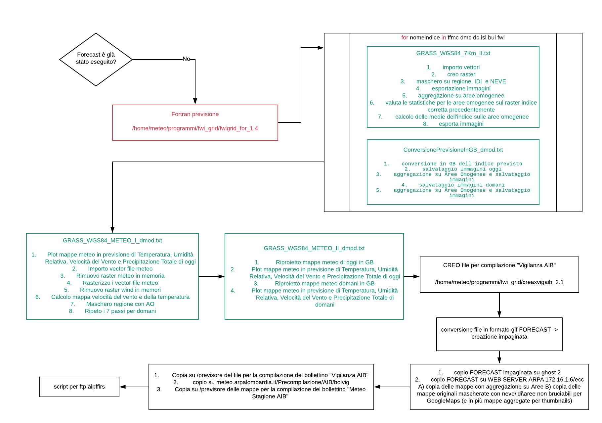

# AIB
## Decrizione sommaria della procedura
La procedura per la creazione dei file e delle immagini necessarie alla produzione del Bollettino Anti Incendio Boschivo si compone di due fasi:

**1. analisi**: viene elaborato il file di copertura nevosa, i dati rilevati (nel dBMETEO, via R), viene fatta l'interpolazione 
(FORTRAN compilato & bash), viene fatto il calcolo degli indici (FORTRAN compilato) e una prima aggregazione su grigliato (GRASS), 
quindi l'aggregazione definitiva per aree di allerta (GRASS).

https://app.lucidchart.com/invitations/accept/1d353ef9-8581-4a63-be2c-76e3f76e1c6d

**2. previsione:** 

## Organizzazione dei file
L'organizzazione degli script e dei programmi è la seguente (_nota: estratta solo la parte in milanone che corrisponde agli script; i programmi eseguibili e i relativi sorgenti non sono compresi in questo repository_)

**./asci2grads** contiene gli script attualmente presenti su Mediano per convertire i dati da formato ascii a grads e usati per sostituire lo script oi_fwi.sh dalla procedura di calcolo degli indici (GTER srl - 2018)

**./script** contiene gli script principali e quello lanciato da crontab

**./script/interpolazione** contiene gli script e i programmi per l'interpolazione statistica

**./script/fwi/conversione_img_neve** script di conversione del file immagine satellitare copertura nevosa

**./programmi/getdata** contiene gli script per l'acquisizione dei dati dal dBMETEO

**./programmi/grass_work** contiene gli script per l'acquisizione dei dati dal dBMETEO

**./dev/redist/fwidbmgr** contiene sorgente ed eseguibili C++ dell'applicativo usato per memorizzare gli indici calcolati (??) su 
database 

                      
